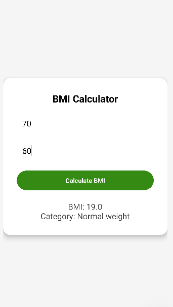

BMI Calculator App

An Android application built with Java and XML to calculate the Body Mass Index (BMI).
The app helps users track their health by providing BMI values and categorizing them into health ranges.

📱 Features

Input weight (kg) and height (inches).

Instant BMI calculation.

Displays BMI category (Underweight, Normal, Overweight, Obese).

Clean and simple UI.

Built with Java and XML (Android Layouts).

🚀 Tech Stack

Language: Java

UI: XML Layouts

IDE: Android Studio
